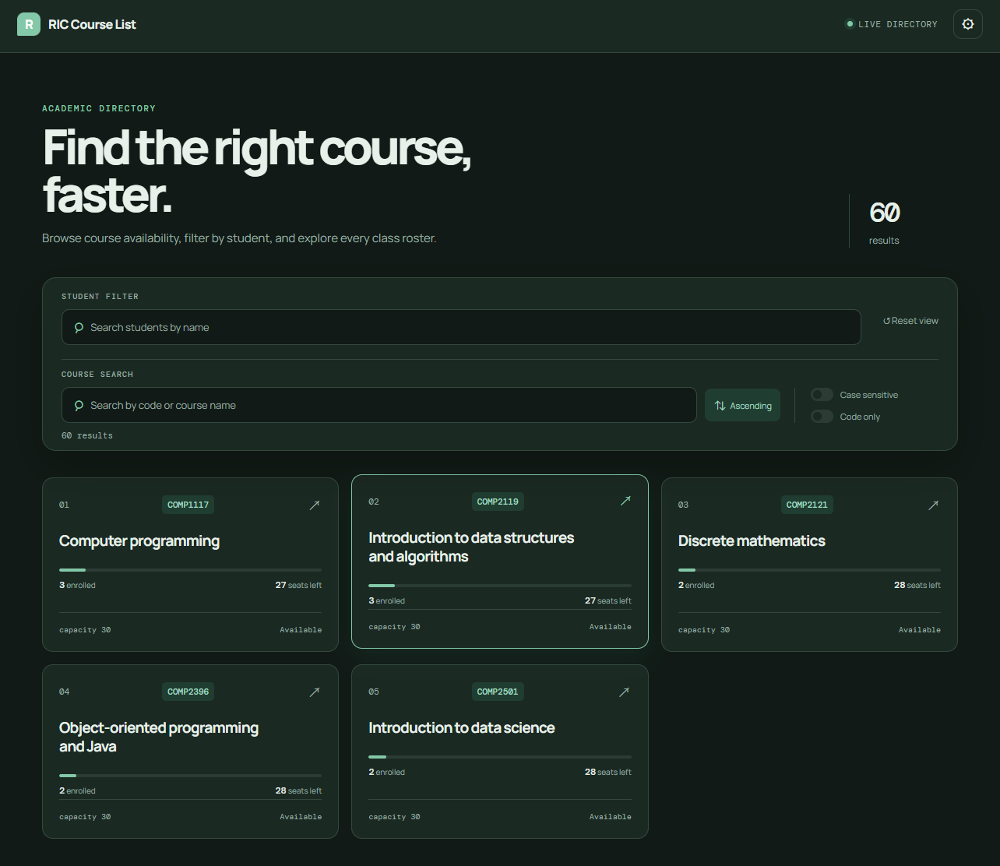
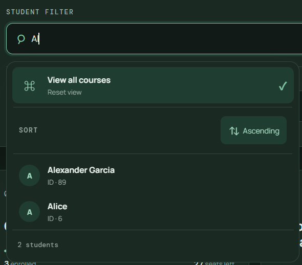
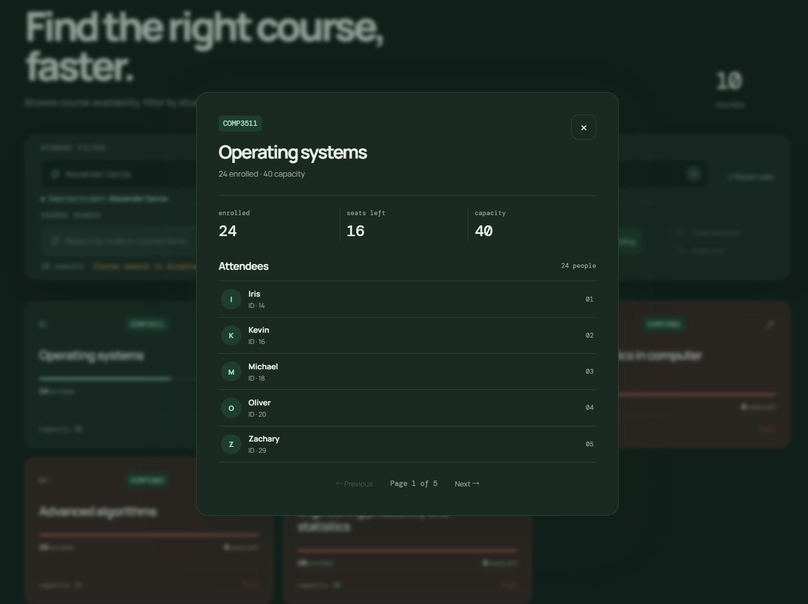

# RICCourseList

A full-stack course management and lookup system built for RIC.

RICCourseList provides a web interface for browsing courses and students, searching and sorting course information, viewing course attendees, and managing favorite courses.

## Features

* 📚 **Course List**

  * Browse all available courses
  * Search by course code or name
  * Case-sensitive / case-insensitive search
  * Search by course code only
  * Sort courses by code
  * Pagination



* 👨‍🎓 **Student List**

  * Browse students
  * Search and view student information
  * View courses associated with a student



* 👥 **Course Attendees**

  * View students enrolled in a selected course
  * Navigate between courses and their attendees



## Tech Stack

### Frontend

* React
* TypeScript
* Vite

### Backend

* Go
* Gin
* pgx
* PostgreSQL

### Development

* VS Code
* Git / GitHub
* Replit
* ChatGPT

## Architecture

RICCourseList follows a simple full-stack architecture:

```text
┌──────────────────────┐
│      React / TS      │
│       Frontend       │
└──────────┬───────────┘
           │ HTTP / JSON
           ▼
┌──────────────────────┐
│      Go + Gin        │
│        API           │
└──────────┬───────────┘
           │ SQL
           ▼
┌──────────────────────┐
│      PostgreSQL      │
│       Database       │
└──────────────────────┘
```

The frontend communicates with the backend through REST APIs. The backend handles request validation, query construction, pagination, and database access.

## Project Structure

RICCourseList/
├── backend/
│   ├── course/
│   ├── student/
│   ├── database/
│   │   └── migrations/
│   ├── webService/
│   └── main.go
│
├── frontend/
│   ├── src/
│   │   ├── api/
│   └── package.json
│
└── README.md
# RICCourseList

A full-stack course management and lookup system built for RIC.

RICCourseList provides a web interface for browsing courses and students, searching and sorting course information, viewing course attendees, and managing favorite courses.

## Features

* 📚 **Course List**

  * Browse all available courses
  * Search by course code or name
  * Case-sensitive / case-insensitive search
  * Search by course code only
  * Sort courses by code
  * Pagination

* 👨‍🎓 **Student List**

  * Browse students
  * Search and view student information
  * View courses associated with a student

* 👥 **Course Attendees**

  * View students enrolled in a selected course
  * Navigate between courses and their attendees

* ⭐ **Favorites**

  * Add and remove favorite courses
  * View a user's favorite courses

* ⚙️ **Query Settings**

  * Configurable sorting order
  * Case sensitivity
  * Code-only search
  * Pagination settings

## Tech Stack

### Frontend

* React
* TypeScript
* Vite
* Tailwind CSS
* shadcn/ui

### Backend

* Go
* Gin
* pgx
* PostgreSQL

### Development

* Git / GitHub
* Lovable
* VS Code

## Architecture

RICCourseList follows a simple full-stack architecture:

```text
┌──────────────────────┐
│      React / TS      │
│       Frontend       │
└──────────┬───────────┘
           │ HTTP / JSON
           ▼
┌──────────────────────┐
│      Go + Gin        │
│        API           │
└──────────┬───────────┘
           │ SQL
           ▼
┌──────────────────────┐
│      PostgreSQL      │
│       Database       │
└──────────────────────┘
```

The frontend communicates with the backend through REST APIs. The backend handles request validation, query construction, pagination, and database access.

## Project Structure

```text
RICCourseList/
├── backend/
│   ├── course/
│   ├── student/
│   ├── database/
│   │   └── migrations/
│   ├── api/
│   └── main.go
│
├── frontend/
│   ├── src/
│   │   ├── components/
│   │   ├── pages/
│   │   ├── course/
│   │   └── student/
│   └── package.json
│
└── README.md
```

## Database

The current database uses PostgreSQL.

Main entities include:

```text
students
    │
    │ many-to-many
    ▼
student_courses
    ▲
    │ many-to-many
    │
courses
```

The `student_courses` table represents the relationship between students and courses.

Primary keys and foreign-key constraints are used to maintain data integrity.

## API

The backend provides RESTful APIs under the `/api` prefix.

All list endpoints support pagination through:

* `current` — current page number
* `page_size` — number of items per page
* `ascending` — whether the results are sorted in ascending order

Successful responses follow the general structure:

```json
{
  "meta": {
    "total_count": 0,
    "number_of_pages": 0
  },
  "body": []
}
```

### Courses

```http
GET /api/courses
```

Query parameters:

| Parameter        | Type    | Description                                   |
| ---------------- | ------- | --------------------------------------------- |
| `search`         | string  | Search keyword                                |
| `current`        | integer | Current page number                           |
| `page_size`      | integer | Number of courses per page                    |
| `case_sensitive` | boolean | Whether the search is case-sensitive          |
| `code_only`      | boolean | Search only within course codes               |
| `ascending`      | boolean | Sort courses in ascending or descending order |

Example:

```http
GET /api/courses?search=COMP&current=1&page_size=10&case_sensitive=false&code_only=false&ascending=true
```

### Students

```http
GET /api/students
```

Query parameters:

| Parameter   | Type    | Description                                    |
| ----------- | ------- | ---------------------------------------------- |
| `name`      | string  | Search keyword for student names               |
| `current`   | integer | Current page number                            |
| `page_size` | integer | Number of students per page                    |
| `ascending` | boolean | Sort students in ascending or descending order |

Example:

```http
GET /api/students?name=Jason&current=1&page_size=10&ascending=true
```

### Course Attendees

```http
GET /api/courses/:id/attendees
```

Returns the students enrolled in a specific course.

Path parameters:

| Parameter | Type    | Description |
| --------- | ------- | ----------- |
| `id`      | integer | Course ID   |

Query parameters:

| Parameter   | Type    | Description                                    |
| ----------- | ------- | ---------------------------------------------- |
| `current`   | integer | Current page number                            |
| `page_size` | integer | Number of students per page                    |
| `ascending` | boolean | Sort students in ascending or descending order |

Example:

```http
GET /api/courses/1/attendees?current=1&page_size=10&ascending=true
```

### Student Attended Classes

```http
GET /api/students/:id/attended_classes
```

Returns the courses attended by a specific student.

Path parameters:

| Parameter | Type    | Description |
| --------- | ------- | ----------- |
| `id`      | integer | Student ID  |

Query parameters:

| Parameter   | Type    | Description                                   |
| ----------- | ------- | --------------------------------------------- |
| `current`   | integer | Current page number                           |
| `page_size` | integer | Number of courses per page                    |
| `ascending` | boolean | Sort courses in ascending or descending order |

Example:

```http
GET /api/students/1/attended_classes?current=1&page_size=10&ascending=true
```

### Error Responses

Invalid request parameters return HTTP `400 Bad Request` with an error message.

Example:

```json
{
  "error": "Invalid course ID"
}
```

Internal database errors return HTTP `500 Internal Server Error`.

```json
{
  "error": "..."
}
```

### Query Validation

The backend validates and sanitizes query parameters before constructing SQL queries.

For example:

* Page numbers must be positive.
* Page sizes are restricted to a reasonable range.
* Search strings are length-limited.
* `%`, `_`, and `\` are escaped when used in SQL `LIKE` queries.
* Sorting fields and ordering are explicitly controlled.
* Pagination uses SQL `LIMIT` and `OFFSET`.

This prevents malformed requests from reaching the database and avoids treating user-provided search characters as unintended SQL pattern operators.

## Author

**Guo Zichen (Jason)**

GitHub: [@guozi](https://github.com/guozi)
